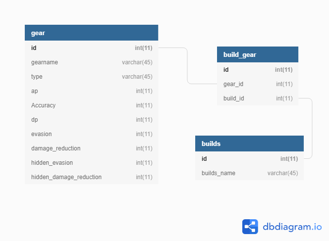
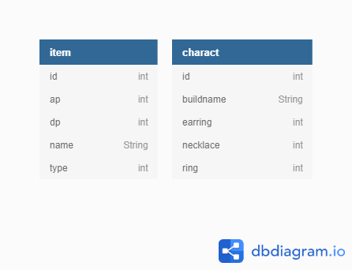

# Personal Project Black Desert Build Planner

## Brief

To create an OOP-based application with utilisation of supporting tools, methodologies and technologies that encapsulate all core modules covered during training.

### Solution

I have decided to make a Planner for the MMO Black Desert Online which would allow the user to create, see, update and delete builds with certain selections of items.

### Entity Relationship Diagrams
#### Initial Solution

My inital plan for the project consisted of having 3 tables, 1 for the Items, 1 for the Builds and an intermediate table that takes a foreign key from both other tables. However due to the time constraints I decided to simplify my project.

#### Delivered Solution

The final solution consisted of having 2 tables  that has no relation between the databses as this was achievable to make a backend for, however I do have the SQL to generate the tables as described in my intial swolution.

## Testing

For testing in this project I have used Selenium, JUnit and Mockito for automated testing. I currently have no selenium tests working.

### Report

[Link to Surefire Report](/Documents/surefire-report.pdf)

Test coverage for the backend is at 86% line coverage and 100% class coverage.

## Depolyment

The build and deployment processes were automated using Jenkins, with a webhook to GitHub that calls commands in a JenkinsFile there.

This application can run both locally using a localhost server or externally via a GCP instance, however Jenkins only runs when deploying to a GCP instance.

## Improvements for the Future

In my current build, as previously stated I am not currently using foreign keys to make my databases. In my next sprint, I would like to change the functionality on the backend to allow for this. This would then allow me to add upgrade levels for each of the items in a further database without having to add a large amount of data manually to the tables.

In later sprints i would like to add login functionality to the system. This would allow users to choose whether the build that they make is public or private and would prevent one user from being able to delete a build created by another person.

## Author

Alex Brew
